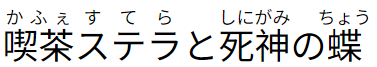
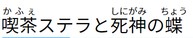
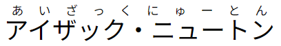
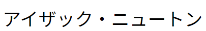

# Japanese Furigana Normalize

This package provides a utility function to normalize Japanese readings
containing furigana. It is particularly useful for creating Rikaitan dictionaries
and ensuring the readings are properly aligned with the kanji characters.

## Purpose

Let's say you have a term such as `喫茶ステラと死神の蝶` and its reading
`かふぇすてらとしにがみのちょう`. The term contains the katakana `ステラ`, but
the reading is in hiragana. So if you were to put this into a Rikaitan
dictionary, you would want to normalize the reading to
`かふぇステラとしにがみのちょう` so that there is no unnecessary furigana on top
of the katakana characters. This package handles this as well as other cases to
ensure the readings are properly handled by Rikaitan.

|    |    |
| :--------:                                          | :--------:                                         |
|  |  |
| **Before normalization**                            | **After normalization**                            |

## Installation

```
npm install japanese-furigana-normalize
```

## Usage

The primary function provided by this package is
`normalizeReading(term: string, reading: string)`, which takes two parameters:

- `term`: The term or phrase.
- `reading`: The corresponding reading in hiragana.

The function normalizes the reading to match and align with the kanji characters
present in the term.

For example:

```typescript
import { normalizeReading } from 'japanese-furigana-normalize';

const term = '喫茶ステラと死神の蝶'; // Kanji term
const reading = 'かふぇすてらとしにがみのちょう'; // Hiragana reading
const normalizedReading = normalizeReading(term, reading);
console.log(normalizedReading); // Output: かふぇステラとしにがみのちょう
```

For more examples, you can refer to the
[`normalizeReading.test.ts`](./src/test/normalizeReading.test.ts) file.
